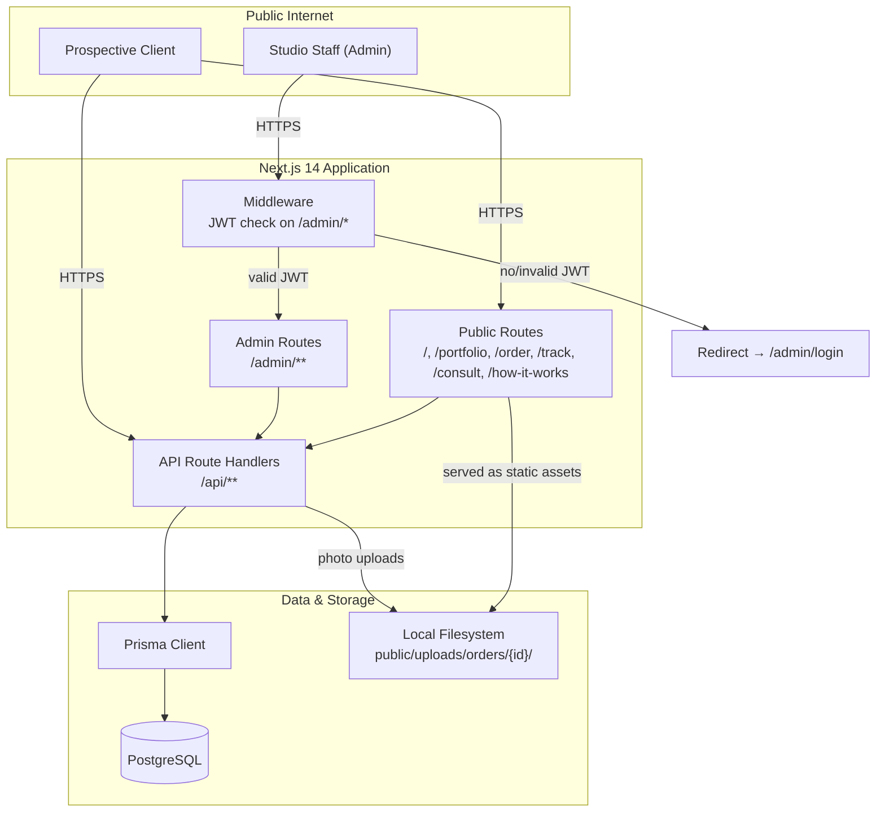
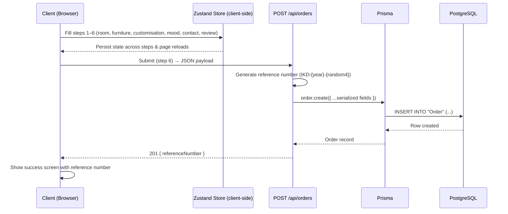
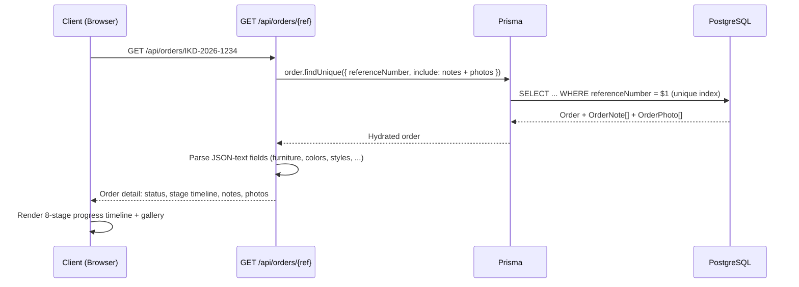
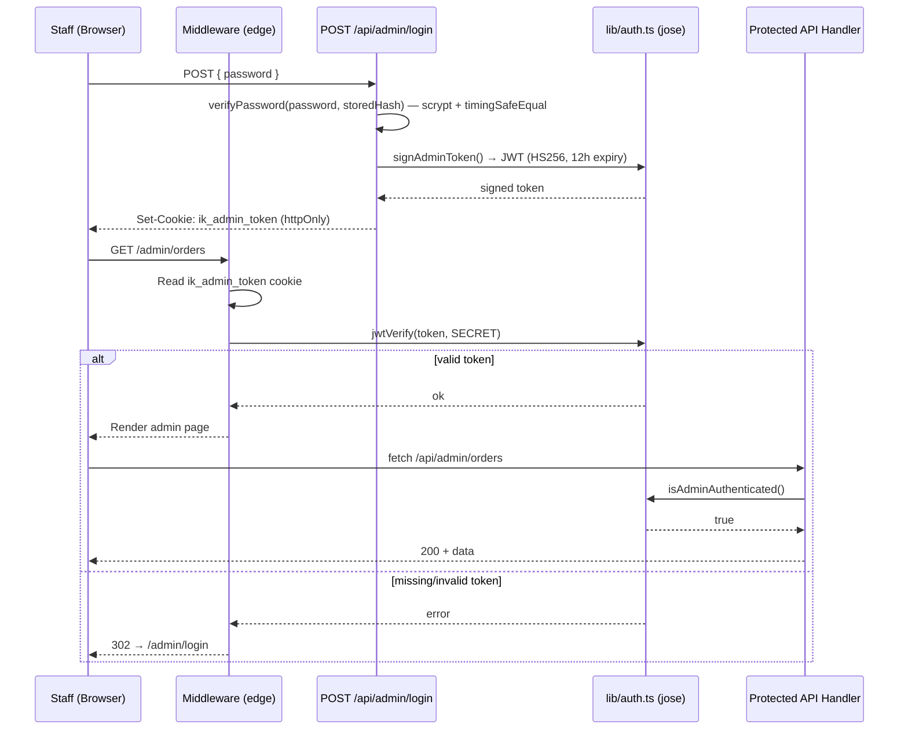
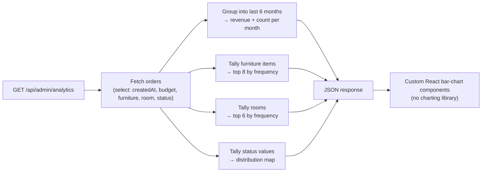
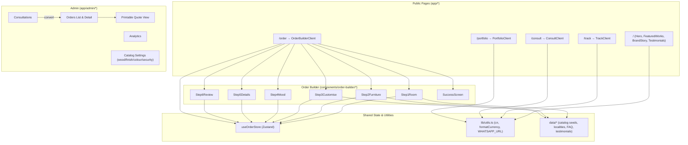
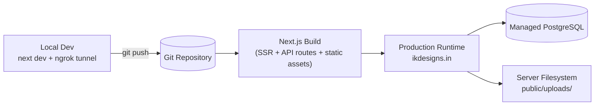

# Architecture — IK Designs

This document describes the system architecture of IK Designs at a level a senior engineer could follow without reading the source: how requests flow through the system, how data moves between layers, how the admin area is secured, and how the application is deployed.

## 1. System Overview

IK Designs is a single Next.js 14 (App Router) application that serves three audiences from one codebase: the public marketing/portfolio site, the client-facing order builder and tracking experience, and an internal admin dashboard. There is no separate backend service — API route handlers under `app/api/**` act as the application's backend, talking to PostgreSQL through Prisma.

## 2. Request Flow — Public Order Submission

This trace shows how a client's six-step order becomes a trackable database record.

Arrays and nested objects (`furniture`, `furnitureCustomizations`, `colors`, `styles`) are JSON-serialised by the API handler before insertion into `TEXT` columns, and parsed back out on every read path (`GET /api/orders/{ref}`, `GET /api/admin/orders`, etc.).

## 3. Request Flow — Order Tracking (No Account Required)

Because the lookup key is a unique, generated reference number rather than a user session, this entire flow requires no authentication — by design, to keep tracking frictionless for clients.

## 4. Admin Authentication & Route Protection

Two layers protect the admin area: edge middleware (coarse-grained, runs before any page renders) and per-handler checks (fine-grained, runs inside each API route).

The password itself is never compared in plaintext: `lib/password.ts` hashes with `scrypt` and a random salt, then compares using `timingSafeEqual` to avoid timing side-channels. The hash is stored via the generic `SystemConfig` key/value table, so rotating the credential doesn't require a schema change.

## 5. Data Flow — Analytics Aggregation

The admin analytics dashboard is computed server-side on each request rather than maintained as a materialised view or precomputed table — appropriate at the studio's current order volume.

## 6. Component & Module Relationships

## 7. Deployment & Runtime

Database schema changes are managed through Prisma Migrate (`prisma/migrations/`), and the catalog tables are seeded via a dedicated `prisma/seed.ts` script — meaning the entire product catalog (wood types, finishes, colour palette) can be reproduced from source rather than hand-entered per environment.

## Summary

The system deliberately avoids premature distribution: one framework, one database, one deployment unit. The architectural complexity that *does* exist — JWT verification at the edge, JSON-text serialisation for flexible order data, server-computed analytics, multipart photo uploads to local disk — is concentrated where the domain genuinely needs it, rather than spread across a microservice topology that this product's scale doesn't yet justify.
