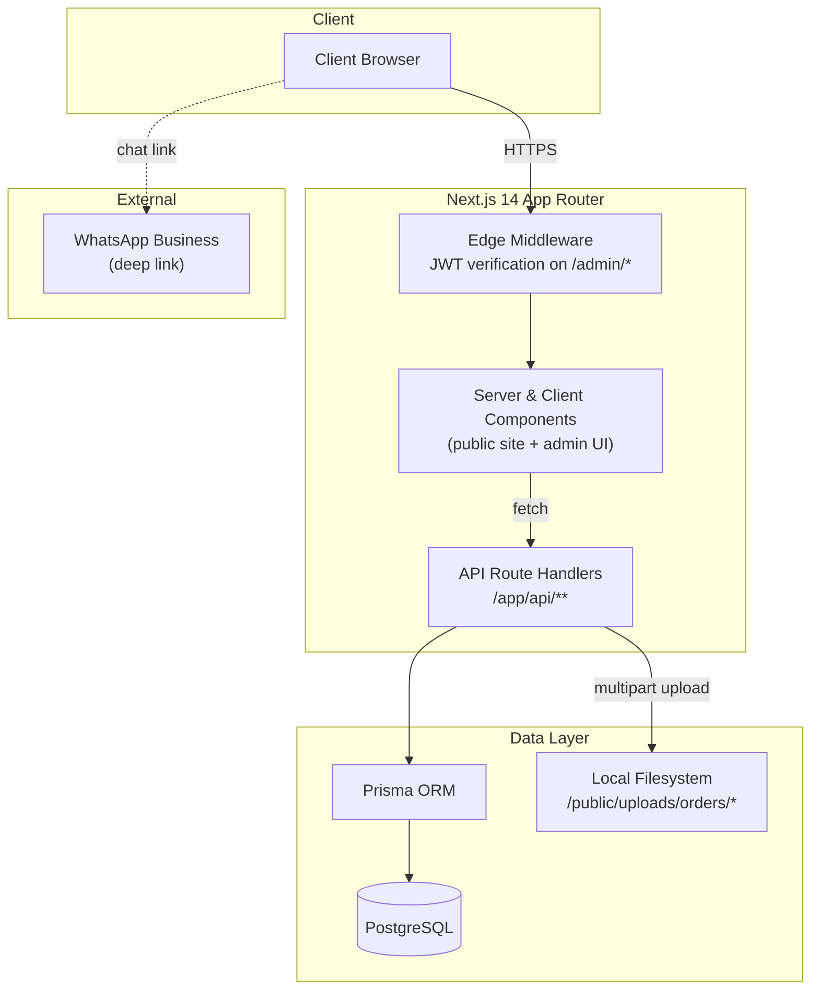
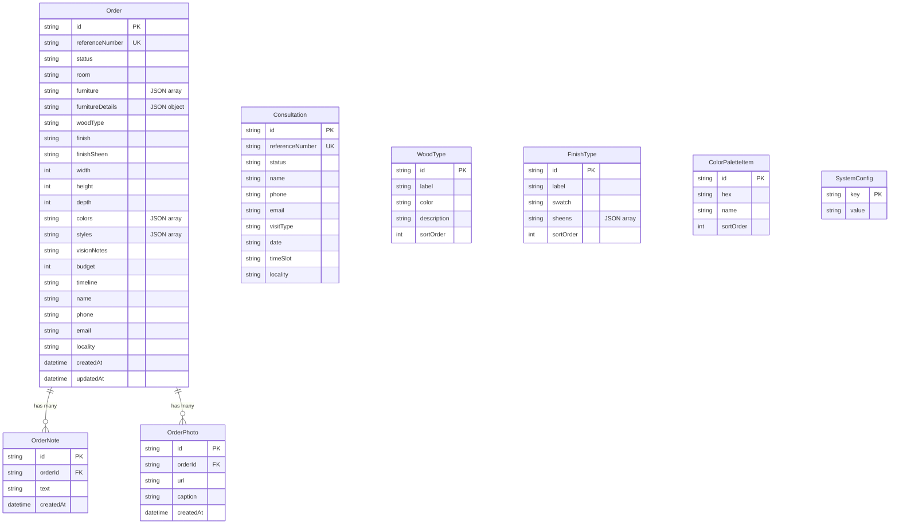

# IK Designs — Custom Furniture Platform

A full-stack platform for a Hyderabad-based custom furniture studio: a guided order builder for clients, public order tracking, and an internal admin system for running the entire business pipeline.

🔗 **Live:** [ik-designs.in](https://ik-designs.in)

---

## Overview

IK Designs is a production website for a Hyderabad-based custom furniture studio that replaces the traditional "call us and describe what you want" process with a structured, guided digital experience. Clients specify exactly what they want — room, furniture type, shape, materials, finishes, dimensions, color palette, and style — through a six-step builder, then track their order's progress from confirmation to delivery using nothing but a reference number.

It serves two distinct audiences from a single codebase: prospective clients researching and commissioning bespoke furniture (sofas, beds, wardrobes, dining sets, and more), and the studio's own staff, who run their entire pipeline — leads, consultations, active orders, and product catalog — through a purpose-built admin dashboard, replacing what used to live across spreadsheets and WhatsApp threads.

What makes it technically interesting is the breadth covered by one Next.js application: a multi-step form with genuinely branching state (every furniture item gets its own shape, material, finish, sheen, and dimension configuration), public order tracking with no user accounts, a JWT-secured admin area with full CRUD over a live product catalog, server-side analytics aggregation rendered through hand-built chart components, and a print-ready PDF quote generator — all sharing one Prisma schema and one design system.

## Key Features

### For Clients
- **Six-Step Custom Order Builder** — Guides clients through room → furniture selection → per-item customisation (shape, primary/secondary material, finish, sheen, dimensions, colour) → mood board (style tags, budget, timeline, reference images) → contact details → review. State is held in a Zustand store so progress survives navigation between steps.
- **Order Tracking by Reference Number** — No account needed: entering an `IKD-YYYY-NNNN` reference shows a live 8-stage progress timeline (Received → Design Review → Materials Sourced → In Production → Quality Check → Ready → Delivered → Closed), plus admin notes and uploaded progress photos.
- **Consultation Booking** — Clients schedule a home visit, showroom visit, or video call from real time slots and a curated list of Hyderabad localities.
- **Portfolio Gallery** — A categorised showcase (Bedroom, Living Room, Dining, Office, Décor, Pooja Room) of completed projects with material, style, location, and year per piece.
- **WhatsApp Integration** — A floating action button links straight to the studio's WhatsApp Business line for instant queries.

### For the Studio (Admin Dashboard)
- **Order Management** — Searchable, filterable order list (by status, date range, name/phone/reference) with detail views, status updates, an internal notes timeline, and per-order progress-photo uploads.
- **Consultation → Order Conversion** — Staff convert a booked consultation directly into a full order, auto-carrying the client's details and generating a fresh order reference — closing the loop between lead and commission with zero re-entry.
- **Analytics Dashboard** — Custom-built bar charts (no charting library) for six-month revenue & volume trends, top furniture types, room breakdown, and order-status distribution — all aggregated server-side from raw order records.
- **Catalog Management** — Full CRUD over the wood types, finish types (with sheens), and colour palette that power the client-facing order builder, so the studio can update its offering without a code deploy.
- **Printable Quotes** — One click generates a print-ready, letterhead-styled PDF estimate for any order.
- **Secure Admin Access** — Password-only login behind a JWT cookie, scrypt password hashing with timing-safe comparison, and route-level middleware protection across the entire `/admin` tree.

## Architecture Overview

The whole product — public marketing site, order builder, tracking, and admin operations — lives in a single Next.js App Router project, keeping the design system, Prisma schema, and auth logic shared rather than duplicated across services. Authentication is enforced at the edge via Next.js middleware matching `/admin/:path*`, so protected routes never reach the page layer without a valid signed JWT. Order photo uploads are written directly to the local filesystem under `public/uploads`, which keeps the stack simple and dependency-free at the studio's current scale.

## Tech Stack

| Category | Technology | Why |
|---|---|---|
| Framework | **Next.js 14** (App Router) | One codebase serves the marketing site, the multi-step builder, and the admin dashboard, mixing server and client rendering where each makes sense |
| Language | **TypeScript** | End-to-end type safety across API route handlers, Prisma models, and React components |
| Styling | **Tailwind CSS** | Utility-first styling for a fully custom brand design system (warm walnut/cream palette, serif/sans type pairing) |
| ORM / Database | **Prisma + PostgreSQL** | Type-safe queries and migrations over a relational store that cleanly models orders, notes, photos, and catalog data |
| Client State | **Zustand** | A minimal global store that keeps the six-step order builder's state alive across steps without context boilerplate or prop drilling |
| Animation | **Framer Motion** | Declarative transitions across the marketing site and the step-by-step builder |
| Auth | **jose (JWT)** + httpOnly cookies | Stateless, signed admin sessions verified directly in middleware — no session store required |
| Forms | **React Hook Form** | Performant, validation-friendly forms for consultation booking and client detail capture |
| Icons | **lucide-react** | A consistent icon set matching the rest of the design system |

## Database Schema

`Order` is the central entity — `OrderNote` and `OrderPhoto` cascade-delete with their parent and form an audit/progress trail per order. `Consultation` is intentionally a separate model rather than an `Order` sub-state, since a consultation may never convert into a commission. `WoodType`, `FinishType`, and `ColorPaletteItem` act as an admin-editable catalog that drives the client-facing order builder, and `SystemConfig` is a generic key/value store (used for things like the hashed admin password) so new runtime settings don't require schema migrations.

## API Design

All admin endpoints sit behind `isAdminAuthenticated()` (server-side JWT check) and are additionally gated by edge middleware on the `/admin/*` route tree.

**Public — Orders & Consultations**
- `POST /api/orders` — Submit a new custom order; generates a unique `IKD-YYYY-NNNN` reference number
- `GET /api/orders/{ref}` — Look up an order by reference number; returns status, specs, notes, and photos
- `POST /api/consult` — Book a design consultation; generates an `IKC-YYYY-NNNN` reference number
- `GET /api/settings` — Fetch the active wood types, finish types (with sheens), and colour palette for the order builder

**Admin — Authentication**
- `POST /api/admin/login` — Password-only login; verifies against a stored hash and issues a signed JWT cookie
- `POST /api/admin/logout` — Clears the admin session cookie
- `PUT /api/admin/settings/password` — Change the admin password (requires current password, re-hashes with scrypt)

**Admin — Orders**
- `GET /api/admin/orders` — List orders, filterable by status, date range, and free-text search (name / phone / reference)
- `GET /api/admin/orders/{id}` — Full order detail
- `PATCH /api/admin/orders/{id}` — Update order status / fields
- `POST /api/admin/orders/{id}/notes` — Append an internal note to an order's timeline
- `GET /api/admin/orders/{id}/photos` — List progress photos for an order
- `POST /api/admin/orders/{id}/photos` — Upload progress photos (multipart)
- `DELETE /api/admin/orders/{id}/photos/{photoId}` — Remove a progress photo

**Admin — Consultations**
- `GET /api/admin/consultations` — List booked consultations
- `PATCH /api/admin/consultations/{id}` — Update a consultation's status / details
- `POST /api/admin/consultations/{id}/convert` — Convert a consultation into a full order, carrying over client details and generating a new order reference

**Admin — Analytics & Catalog**
- `GET /api/admin/analytics` — Aggregated dashboard metrics: monthly revenue & volume, top furniture types, room breakdown, status distribution
- `GET / POST /api/admin/settings/{wood-types | finishes | colors}` plus `PATCH / DELETE .../{id}` — full CRUD over the client-facing product catalog

## Key Technical Decisions

**1. JSON-as-text columns for structured order data**
Fields like `furniture`, `furnitureDetails`, `colors`, and `styles` are stored as JSON-encoded strings in `TEXT` columns rather than as native arrays, JSON columns, or normalised join tables.
*Trade-off:* this sacrifices the ability to query inside those structures at the database level, but it kept the schema and migrations simple for a domain where the *shape* of "furniture details" varies per item and per order. The application layer owns parsing on read and serialising on write.

**2. Reference-number lookup instead of client accounts**
Order tracking (`/api/orders/{ref}`) and consultation booking work entirely off generated reference numbers (`IKD-YYYY-NNNN`, `IKC-YYYY-NNNN`) rather than requiring clients to register and log in.
*Trade-off:* this removes all signup friction — a real consideration for a furniture studio's customer base — at the cost of relying on the reference number itself as the access key. It's a deliberate bet that low-friction tracking matters more than account-gated security for this kind of public order status.

**3. Stateless JWT admin auth enforced in middleware**
Admin sessions are signed JWTs (`jose`) stored in an httpOnly cookie and verified both in Next.js edge middleware (`middleware.ts`, matching `/admin/:path*`) and again inside each protected route handler via `isAdminAuthenticated()`.
*Trade-off:* this avoids running a session store for what is effectively a single-admin system, while the middleware layer means unauthenticated requests are redirected before they ever reach a page or API handler — defense in depth with minimal infrastructure.

**4. Local filesystem storage for order photos**
Progress photos uploaded by staff are written to `public/uploads/orders/{orderId}/` on the server's filesystem rather than to an object-storage service like S3 or Cloudinary.
*Trade-off:* this is the simplest possible option and avoids an external dependency and its costs at the studio's current order volume — but it does mean storage and deployment are coupled to a single server instance, a constraint that would need revisiting at meaningfully larger scale.

**5. Hand-built analytics charts instead of a charting library**
The admin analytics dashboard renders bar charts for revenue, furniture mix, room mix, and status distribution using small custom React components rather than a library like Recharts or Chart.js.
*Trade-off:* more code to own, but it keeps the bundle smaller and gives pixel-level control to match the bespoke design system — the charts look like part of the product, not a generic dashboard widget.

**6. Consultation-to-order conversion as a first-class flow**
Rather than treating consultations and orders as the same entity in different states, they're modelled separately, with an explicit `POST /api/admin/consultations/{id}/convert` endpoint that creates a new `Order`, copies over the client's contact details, and marks the consultation `completed`.
*Trade-off:* slightly more modelling work up front, but it accurately reflects the business reality — a consultation can end without a sale — while still removing duplicate data entry for the cases that do convert.

## Performance & Scale Considerations

- **Selective field projection** — the analytics endpoint uses Prisma's `select` to pull only the columns it needs (`createdAt`, `budget`, `furniture`, `room`, `status`) rather than full order rows, before aggregating in memory.
- **Parallelised reads** — `/api/settings` fetches wood types, finishes, and colours concurrently with `Promise.all` rather than sequentially.
- **Sort-order columns** — catalog tables (`WoodType`, `FinishType`, `ColorPaletteItem`) carry an explicit `sortOrder` so admin-controlled display order is a simple indexed query, not client-side sorting logic.
- **Unique-indexed lookups** — `referenceNumber` is a unique constraint on both `Order` and `Consultation`, making the public tracking lookup a single indexed query.
- **Singleton Prisma client** — the Prisma client is cached on the global object in development to avoid exhausting database connections from hot-reload churn (`lib/prisma.ts`).

## What I Learned

- **Modelling "flexible" data in a relational schema is a real design decision, not an afterthought.** Deciding where to draw the line between normalised columns and JSON-in-text (and being deliberate about *which* fields get which treatment) shaped how easy the rest of the app was to build.
- **Auth doesn't need to be complicated to be correct.** A single-admin system with a signed cookie and edge-middleware verification is simpler to reason about — and arguably more robust — than bolting on a full session/user system for one user.
- **Multi-step client state is harder than it looks once it branches.** Once "furniture" became a list where *each item* carries its own shape/material/finish/dimension state, a flat form model stopped working — that's what pushed the order builder toward a structured Zustand store keyed by furniture item.
- **Good internal tools compound.** The consultation-to-order conversion flow and printable quotes weren't in the original spec — they came from watching how the studio actually worked, and they removed entire categories of manual re-entry.

## Status & Roadmap

**Status:** Live in production at [ik-designs.in](https://ik-designs.in), actively used by the studio for client intake and order management.

**Planned next:**
- Cloud-based photo storage to decouple uploads from the server's filesystem
- Automated client notifications (WhatsApp/SMS/email) on order status changes
- Expanded analytics (conversion rates from consultation → order, locality-based demand trends)

---

Built solo by **Mohammed Waliuddin**, as part of **Aether AI** agency work.
